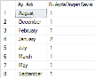

1-Normalize edilmemiş bir başlangıç tablosu tasarlayınız. Daha sonra bu
tablonun üzerinde 1NF ve 2NF normalizasyon kurallarını uygulayarak
veritabanının son halini gösteriniz.

***Aşağidaki sorularda Northwind veritabanı kullanılacaktır.***

2-Customers tablosuna "RegistrationDate" isminde içine sadece tarih
girilebilecek, sistem saattarih değerinden büyük olamayacak ve veri
girişi yapılmazsa sistem saattarih değeri otomatik yazılacak olan bir
alan için gerekli SQL kodunu yazınız.

3-Hiç satışı yapılmamış olan ürünlerin isimleri (Products-ProductName)
ve tedarikçilerinin (Suppliers-CompanyName) isimleri listesini
"Hic_Satilmayan_Urunler" isimli bir tablo oluşturup içine atacak olan
SQL ifadesini yazınız. (Select ile tablo oluşturulacaktır.)

4-Çalışan personellerin (Employees) doğum günlerinin (Birthdate) aylara
göre dökümünü şekildeki gibi veren SQL ifadesini yazınız.

5-Her siparişin (OrderID) hangi müşteri (Customers-ContactName)
tarafından alındığı ve hangi kargo şirketiyle (Shippers-CompanyName)
gönderileceği dökümünü veren SQL ifadesini yazınız.

6-En az (sipariş sayısı olarak) hangi "ülkedeki" müşteriler
(Customers-Country) tarafından sipariş verildiği bilgisini veren SQL
ifadesini yazınız. (Sadece ülke ismi listelenecektir.)

